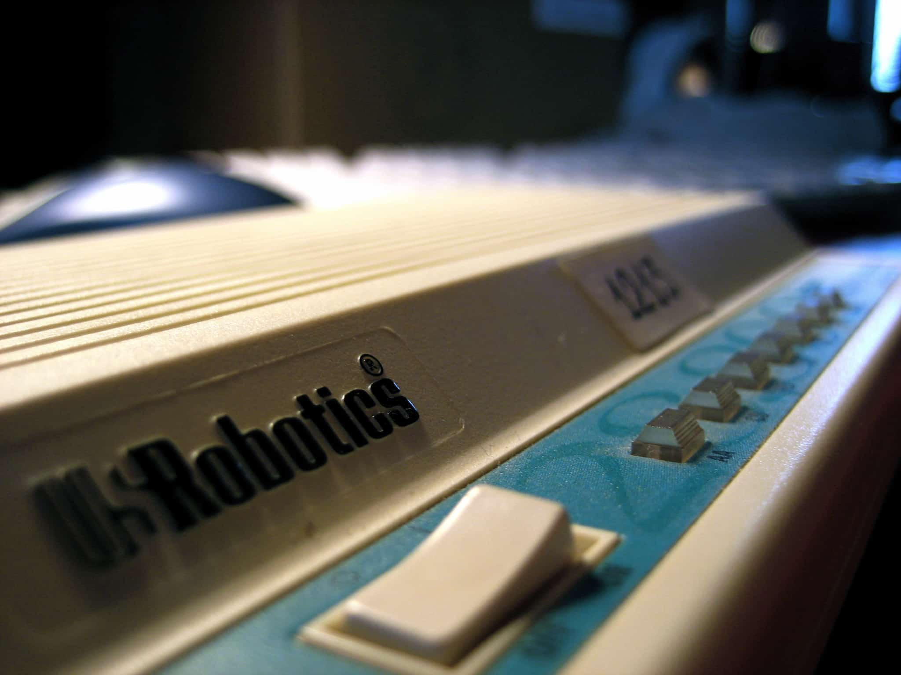
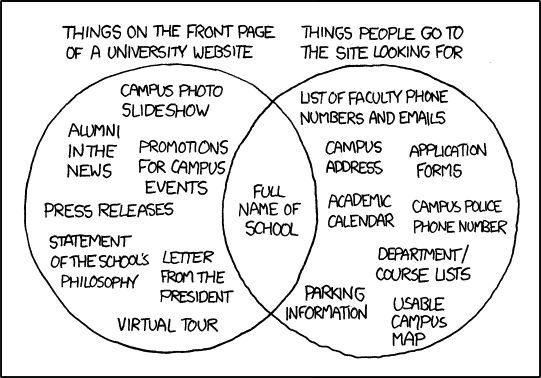

theme: Work, 1
background-color: #FFFFFF
text: #00000, alignment(right)
text-strong: #148BDE
header-strong: #148BDE
header: #00000, line-height(18), text-scale(1.5)
footer-style: #777777, alignment(right), line-height(8), text-scale(0.5), Avenir Next Regular
code: alignment(left), Monako, line-height(1.5)
formula: text-scale(1.5), alignment(center)
list: line-height(16), bullet-character( )
build-lists: true

<!---

Building Web Apps That Don’t Suck

As developers, it’s important to think about our users first: you need to create an awesome experience and part of the equation is to deliver quality, fast. Unfortunately, we lost the habit of being efficient with our code and assets, getting used, if you are lucky, to more and more power from our devices and internet connections. But our users want their data now. Waiting is painful, you know it! It’s not an option anymore…

Based on personal experience, this presentation is about concrete tips and tricks to help you optimize your masterpiece, using HTML, CSS, and JavaScript (most applicable to other languages).

-->

# building web apps
# that don't suck

**Frédéric Harper**
Developer Advocate - DigitalOcean?

@fharper
fred.dev

[.footer: https://unsplash.com/photos/opkaRk20tAw]

---

<!--- coding is fucking hard -->

 

- People who can’t code: Coding is fucking hard!
- People who don’t try at all: Coding is fucking hard!
- Teachers: Coding is fucking hard!
- Novice Developers: Coding is fucking hard!
- Pro Developers: Coding is fucking hard!
- Famous Developers: Coding is fucking hard!
- Business People: Coding is easy!

[.footer: https://twitter.com/AhmadNassri]

---

<!--- coding is fucking hard - what? -->

[.build-lists: false]

 

- People who can’t code: Coding is fucking hard!
- People who don’t try at all: Coding is fucking hard!
- Teachers: Coding is fucking hard!
- Novice Developers: Coding is fucking hard!
- Pro Developers: Coding is fucking hard!
- Famous Developers: Coding is fucking hard!
- **Business People: Coding is easy!**

[.footer: https://twitter.com/AhmadNassri]

---

<!--- mindblow -->

[.footer: https://giphy.com/gifs/stress-i-need-a-drink-brain-explode-2rqEdFfkMzXmo/]

---

<!--- slow phones -->

[.footer: https://www.flickr.com/photos/cannedtuna/466983614/]

---

<!--- small number of devices -->

[.footer: https://www.flickr.com/photos/jesusbelzunce/4366759251/]

---

<!--- slow internet connections -->

[.footer: https://www.flickr.com/photos/cliph/454796520/]

---

<!--- WARNING -->

[.footer: https://www.flickr.com/photos/funadium/1179006213/]

---

<!--- UX & UI -->

# **UX & UI**

---

<!--- 3 motivations -->

[.text: #00000, alignment(left)]

# motivations

 

1. I'm microtasking
1. I'm local
1. I'm bored

---

<!--- XKCD university -->

[.footer: https://xkcd.com/773/]

---

<!--- mobile first before -->

# mobile first

---

<!--- mobile first after -->

# mobile first

---

<!--- flying -->

[.footer: https://www.flickr.com/photos/flyforfun/8449954398]

---

<!--- flying simple -->

---

<!--- flying simple smartwatch -->

---

<!--- comfort zone -->

# comfort zone

  

[.footer: http://j.mp/1m8fgcH (permission from Parachute Design)]

---

<!--- Fitt's law -->

[.text: #00000, alignment(right), text-scale(0.8)]

# Fitt's law

$$
T = a + b × log2 (1 + D / W)
$$

**T:** Average time taken to complete the movement

**a:** Start/stop time of the device

**b:** Inherent speed of the device

**D:** Distance from the starting point to target center

**W:** Width of target, measured along axis of motion

---

<!--- Fitt's law translated -->

[.text: #00000, alignment(right), text-scale(2.5)]

# Fitt's law translated

 

the **bigger** and
**closer** a target is,
the **easier** it is to hit.

---

<!--- Optimize -->

# **optimize**

---

<!--- JS, CSS & HTML -->

# JS, CSS & HTML
## **demo**

^
http://lisperator.net/uglifyjs/
https://cssnano.co/
https://github.com/kangax/html-minifier

---

<!--- HTTP requests -->

# HTTP requests

- avoid or minimize 3xx redirections
- GZIP encoding (htaccess, web.config)
- image sprites when it make sense
- use CDN (Content Distribution Network)
- configure the HTTP Cache Headers (Apache)
- configure HTTP Expires Response Header (IIS)
- cache the content

---

<!--- Google Lighthouse -->

# Google Lighthouse
## **demo**

^
https://developers.google.com/web/tools/lighthouse/

---

<!--- Images -->

# Images

- use native image resolution (original width, height)
- use the right image format (PNG, JPEG…)
- use image preview for videos
- compress your images

---

<!--- Rendering -->

[.text: #00000, alignment(center)]

# rendering

solid black texture sized 1920x1080

:arrow_down:

once compressed = ~5kb PNG

:arrow_down:

decompressed to memory = up to 8mb
(1920 x 1080 x 4 bytes per pixels [rgba]) = 8294400 bytes

---

<!--- Imagemin demo -->

# imagemin
## **demo**

^
https://github.com/imagemin/imagemin-cli
https://shortpixel.com/

---

<!--- misc js -->

[.text: #00000, alignment(right), text-scale(0.9), line-height(1.5)]

# misc js

- use `'strict'` mode
- don’t scale images in drawImage (cache in offscreen canvas)
- use WebGL instead of Context 2D (free up CPU for GPU)
- avoid creating new object when it’s possible
- load JavaScript files at the end of the page
- asynchronously load scripts (async) and fetch data
- JSON is faster than XML

---

<!--- misc -->

[.text: #00000, alignment(right), text-scale(0.9), line-height(1.5)]

# misc

- CSS for large background images
- you don’t always need a framework or a library
- put as much logic as you can on the server-side
- don’t fix it if it’s not broken (human aversion to change)
- create tests, test, and retest
- think accessibility (a11y, pa11y, axe tool)

---

<!--- The extra mile -->

# **the extra mile**

---

<!--- Security -->

# security
### OWASP Secure Coding Cheat Sheet

User Authentication
Password Complexity
Session Management
Access Control
Input Data Validation
Output Encoding
Secure Transmission / Network Layer security
File Uploads
Error Handling

^
https://www.owasp.org/index.php/Secure_Coding_Cheat_Sheet

---

<!--- Security -->

# security
### OWASP Secure Coding Cheat Sheet

Logging and Auditing
Cryptography
Cookie Management
Unvalidated Redirects and Forwards
SQL Injection
Cross Site Scripting
Cross Site Request Forgery
Preventing Malicious Site Framing (ClickJacking)
Insecure Direct Object references

^
https://www.owasp.org/index.php/Secure_Coding_Cheat_Sheet

---

<!--- Snyk -->

# snyk
## **demo**

^
npm also
Also https://securityheaders.com

---

<!--- pa11y -->

# pa11y
## **demo**

---

<!--- the end -->

# **in the end**

---

<!--- the philosophy -->

# the philosophy

 

1. Don’t make us think about the interface
 
1. Insulate us from that complexity
 
1. Make accomplishing our goals easier
 
1. Help users be awesome in the moment!

---

<!--- resources -->

# resources

**slides**
https://github.com/fharper/mytalks

**code**
https://github.com/fharper/XXX

**video**
https://www.youtube.com/user/fredericharper

---

<!--- questions & thanks -->

[.footer-style: #777777, alignment(right), text-scale(1.2), Avenir Next Regular]

 

**Frédéric Harper**
 
fharper@oocz.net
fred.dev

[.footer:  my talks are release under the unlicense license]