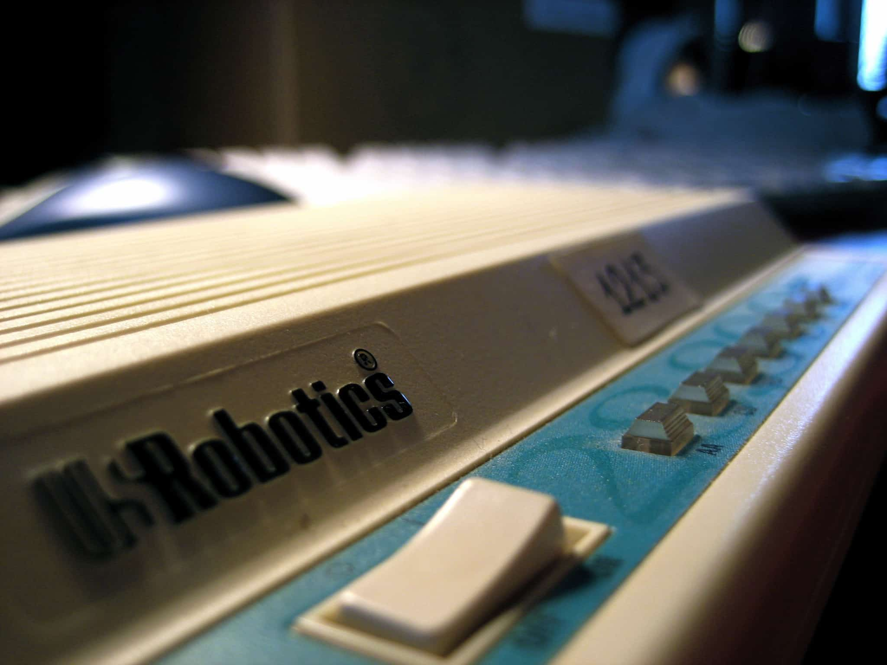
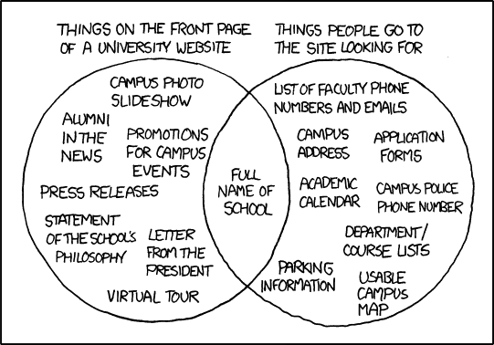
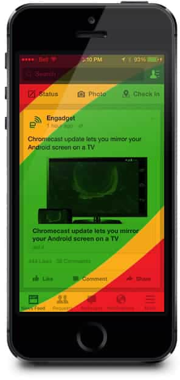
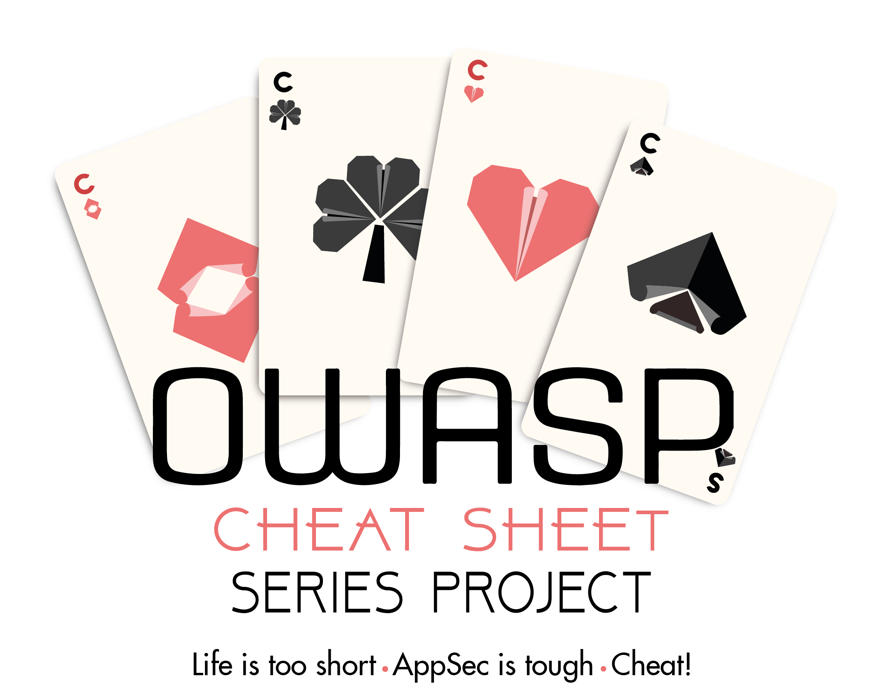

theme: Work, 1
background-color: #FFFFFF
text: #00000, alignment(right)
text-strong: #148BDE
header-strong: #148BDE
header: #00000, line-height(18), text-scale(1.5)
footer-style: #777777, alignment(right), line-height(8), text-scale(0.5), Avenir Next Regular
code: alignment(left), Monako, line-height(1.5)
formula: text-scale(1.5), alignment(center)
list: line-height(16), bullet-character( )
build-lists: true

<!---

Building Web Apps That Don’t Suck
45 minutes

#
# ABSTRACT
#

As developers, it’s important to think about our users first: you need to create an awesome experience and part of the equation is to deliver quality, fast. Unfortunately, we lost the habit of being efficient with our code and assets, getting used, if you are lucky, to more and more power from our devices and internet connections. But our users want their data now. Waiting is painful, you know it! It’s not an option anymore…

Based on personal experience, this presentation is about concrete tips and tricks to help you optimize your masterpiece, using HTML, CSS, and JavaScript (most applicable to other languages).

#
# SETUP
#

npm install -g uglify-js
npm install -g cssnano-cli
npm install -g babel-minify
npm install -g hint
npm install -g imagemin-cli
npm install -g imagemin-pngquant
npm install -g imagemin-jpegtran
npm install -g imagemin-jpeg-recompress
npm install -g snyk

#
# BROWSER
#

http://lisperator.net/uglifyjs/
https://cssnano.co/
https://github.com/babel/minify
https://webhint.io/
https://developers.google.com/web/tools/lighthouse/
https://github.com/imagemin/imagemin-cli
https://shortpixel.com/
https://mochajs.org/
https://qunitjs.com/
https://github.com/OWASP/CheatSheetSeries
https://snyk.io/
https://docs.npmjs.com/cli/audit
https://securityheaders.com

-->

# building web apps
# that don't suck

**Frédéric Harper**
Senior Developer Advocate
DigitalOcean

@fharper
fred.dev

[.footer: https://unsplash.com/photos/opkaRk20tAw]

^ START CAMTASIA!

---

<!--- coding is fucking hard -->

 

- People who can’t code: Coding is fucking hard!
- People who don’t try at all: Coding is fucking hard!
- Teachers: Coding is fucking hard!
- Novice Developers: Coding is fucking hard!
- Pro Developers: Coding is fucking hard!
- Famous Developers: Coding is fucking hard!
- Business People: Coding is easy!

[.footer: https://twitter.com/AhmadNassri]

---

<!--- coding is fucking hard - what? -->

[.build-lists: false]

 

- People who can’t code: Coding is fucking hard!
- People who don’t try at all: Coding is fucking hard!
- Teachers: Coding is fucking hard!
- Novice Developers: Coding is fucking hard!
- Pro Developers: Coding is fucking hard!
- Famous Developers: Coding is fucking hard!
- **Business People: Coding is easy!**

[.footer: https://twitter.com/AhmadNassri]

---

<!--- mindblow -->

[.footer: https://giphy.com/gifs/stress-i-need-a-drink-brain-explode-2rqEdFfkMzXmo/]

---

<!--- slow phones -->

[.footer: https://www.flickr.com/photos/cannedtuna/466983614/]

---

<!--- small number of devices -->

[.footer: https://www.flickr.com/photos/jesusbelzunce/4366759251/]

---

<!--- slow internet connections -->

[.footer: https://www.flickr.com/photos/cliph/454796520/]

---

<!--- WARNING -->

[.footer: https://www.flickr.com/photos/funadium/1179006213/]

^
tired of new shiny things
lazy
believe in small steps can have big impact
build on what you know or knwon

---

<!--- Architect -->

# **architect**

---

<!--- 3 motivations -->

[.text: #00000, alignment(left)]

# motivations

 

1. I'm (micro)tasking
1. I'm local
1. I'm bored

---

<!--- XKCD university -->

[.footer: https://xkcd.com/773/]

---

<!--- mobile first before -->

# mobile first

---

<!--- mobile first after -->

# mobile first

---

<!--- flying -->

[.footer: https://www.flickr.com/photos/flyforfun/8449954398]

---

<!--- flying simple -->

---

<!--- comfort zone -->

# comfort zone

  

[.footer: http://j.mp/1m8fgcH (permission from Parachute Design)]

---

<!--- Fitt's law -->

[.text: #00000, alignment(right), text-scale(0.8)]

# Fitt's law

$$
T = a + b × log2 (1 + D / W)
$$

**T:** Average time taken to complete the movement

**a:** Start/stop time of the device

**b:** Inherent speed of the device

**D:** Distance from the starting point to target center

**W:** Width of target, measured along axis of motion

---

<!--- Fitt's law translated -->

[.text: #00000, alignment(right), text-scale(2.5)]

# Fitt's law translated

 

the **bigger** and
**closer** a target is,
the **easier** it is to hit.

---

<!--- Optimize -->

# **optimize**

---

<!--- JS, CSS & HTML -->

# JS, CSS & HTML
## **demo**

^
use HTML5 boilerplate
minify a > ab
html-minifier --collapse-whitespace --remove-comments --remove-optional-tags --remove-redundant-attributes --remove-script-type-attributes --remove-tag-whitespace--use-short-doctype --minify-css true --minify-js true a > ab

---

<!--- HTTP requests -->

# HTTP requests

- avoid or minimize 3xx redirections
- GZIP encoding (htaccess, web.config)
- image sprites (when it make sense)
- use CDN (Content Distribution Network)
- configure the HTTP Cache Headers (Apache)
- configure HTTP Expires Response Header (IIS)
- cache the content

^
Things I didn't do yet since I just moved my site to DigitalOcean

---

<!--- webhint linter -->

# webhint
## **demo**

^
hint https://fred.dev
Also:
Google Lighthouse (inside Chrome Dev's tools)

---

<!--- Images -->

# Images

- use native image resolution (original width, height)
- use the right image format (PNG, JPEG…)
- use image preview for videos
- compress your images

^
most basic & underestimate thing

---

<!--- Imagemin demo -->

# imagemin
## **demo**

^
use company background OR something from unsplash
imagemin --plugin=jpegtran a > ab
imagemin --plugin=jpeg-recompress a > ab
Also: ShortPixel

---

<!--- tests -->

[.text: #00000, alignment(right), text-scale(0.9), line-height(1.5)]

# tests

- create tests: unit tests, integration tests...
- test yourself, be the dummiest user you can be
- use framework like Mocha or QUnit for JavaScript/Node.js
- test, test and test

---

<!--- misc js -->

[.text: #00000, alignment(right), text-scale(0.9), line-height(1.5)]

# misc js

- use `'strict'` mode
- avoid creating new object when it’s possible
- load JavaScript files at the end of the page
- asynchronously load scripts (async) and fetch data
- JSON is faster than XML
- don’t scale images in drawImage (cache in offscreen canvas)
- use WebGL instead of Context 2D (free up CPU for GPU)

---

<!--- misc -->

[.text: #00000, alignment(right), text-scale(0.9), line-height(1.5)]

# misc

- don’t fix it if it’s not broken (human aversion to change)
- you don’t always need a framework or a library
- put as much logic as you can on the server-side
- think accessibility (a11y, pa11y, axe tool & hint)
- SSL all the things
- don’t fix it if it’s not broken

^
jQuery to get an element from DOM

---

<!--- The extra mile -->

# **the extra mile**

---

<!--- Security -->

# security

 

---

<!--- Snyk -->

# snyk
## **demo**

^
use npx for demo
snyk monitor
npm audit
Security Headers

---

<!--- the end -->

# **in the end**

---

<!--- the philosophy -->

# the philosophy

 

1. Insulate us from the complexity
 
1. Make accomplishing our goals easier & faster
 
1. Help us be awesome in the moment!

---

<!--- resources -->

# resources

**slides**
https://github.com/fharper/mytalks

**video**
https://www.youtube.com/user/fredericharper

---

<!--- questions & thanks -->

[.footer-style: #777777, alignment(right), text-scale(1.2), Avenir Next Regular]

 

**Frédéric Harper**
 
fred@do.co
fred.dev

[.footer:  my talks are release under the unlicense license]