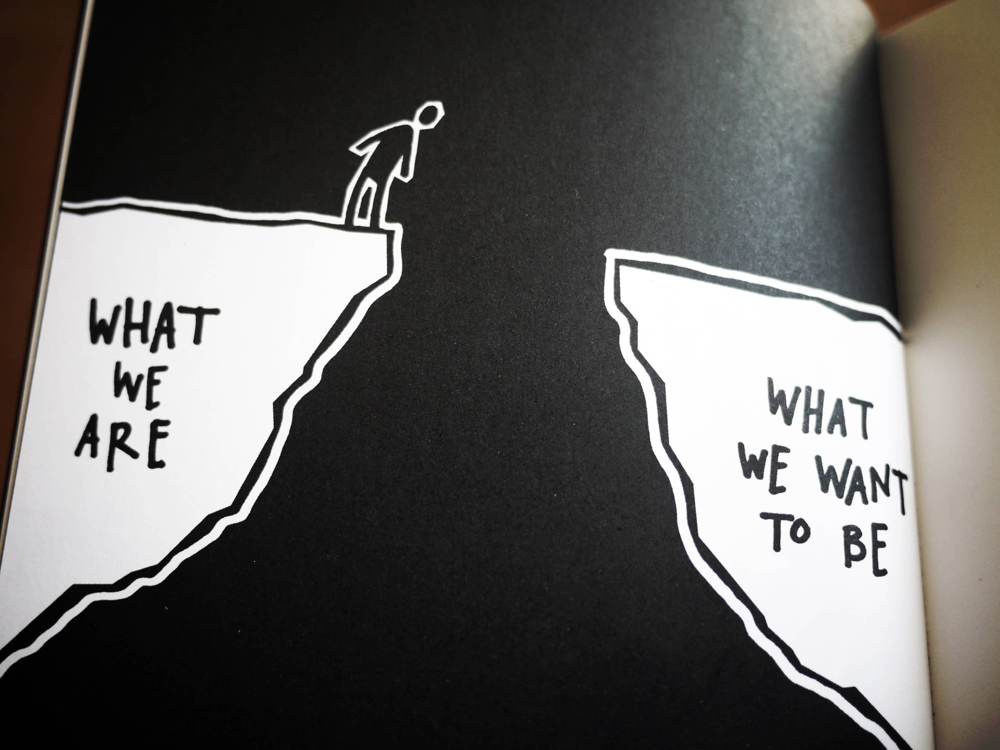
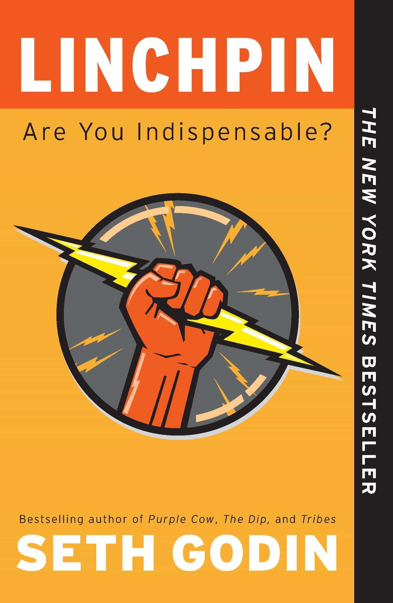

theme: Work, 1
background-color: #FFFFFF
text: #000000, alignment(right)
text-strong: #006AFC
header-strong: #006AFC
header: #000000, line-height(18), text-scale(1.5)
footer-style: #777777, alignment(right), text-scale(0.5), Avenir Next Regular
code: alignment(left), Monako, line-height(1.5)
formula: text-scale(1.5), alignment(center)
list: line-height(16), bullet-character( )
build-lists: true

<!---

Personal Branding: it’s more important than you think

Why should you care about your personal brand? After all, it’s not like you are an actor or the lead singer for a rock band. In fact, it’s never been more important for you to think about yourself as a brand. Doing so will provide rocket fuel for your career. You’ll find better jobs and become a  “thought leader” in your industry. You’ll become known for your expertise and leadership; people will seek your advice and point of view. As a developer, there are many tools you can use to build a personal brand, and this presentation will help you learn how to get visibility, make a real impact, and achieve your goals. You don’t need to be a marketing expert or a personal branding guru— you can be yourself and get your dream job or reach the next level of your career.

45 minutes

-->

# personal branding
# for developers

 

**Frédéric Harper**
Senior Developer Advocate
DigitalOcean

@fharper

[.header: #000000]

[.footer: https://www.flickr.com/photos/57233603@N00/5989016946/]

^
START CAMTASIA!

---

<!--- Firefox -->

###  can you recognize this brand?

[.background-color: #f5f5f5]

[.header: #000000]
[.footer: https://www.flickr.com/photos/grahamsblog/5183837499/]

---

<!--- Pepsi -->

### can you recognize this brand?

[.background-color: #0f4a6e]
[.footer: https://www.flickr.com/photos/grahamsblog/5198067867/]

---

<!--- Harley Davidson -->

### can you recognize this brand?

[.background-color: #f5f5f5]
[.header: #000000]
[.footer: https://www.flickr.com/photos/grahamsblog/5198067439/]

---

<!--- what -->

# **what**

---

<!--- the goal is the same -->

^
the goal is the same

[.footer: https://www.flickr.com/photos/peterfuchs/1239399915/]

---

<!--- personal branding -->

# personal branding

 

an **ongoing process** of developing
**and** maintaining a reputation
**and** impression of an individual

[.text: #00000, alignment(right), text-scale(1.5)]

[.footer: https://en.wikipedia.org/wiki/Personal_branding]

---

<!--- it’s about you -->

^
it's about you

[.footer: https://www.flickr.com/photos/jblndl/5547109579/]

---

<!--- who you are -->

^
- who you really are
- good & bad

[.footer: https://www.flickr.com/photos/illuminaut/3749841579/]

---

<!--- who you wants to be -->

^
- who you wants to be
- not about lying

[.footer: https://unsplash.com/photos/e5eDHbmHprg]

---

<!--- how you want to be seen -->

^
how you want to be seen

[.footer: https://unsplash.com/photos/6yjAC0-OwkA]

---

<!--- what you know -->

^
what you know

[.header: #000000]
[.footer: https://www.flickr.com/photos/mr_t_in_dc/5323104963/]

---

<!--- what you are doing -->

^
what you are doing

[.footer: https://unsplash.com/photos/MAGAXAYq_NE]

---

<!--- what you did -->

^
what you did

[.footer: https://unsplash.com/photos/4DZikSB1tCk]

---

<!--- what you like -->

^
what you like

[.footer: https://unsplash.com/photos/xv7-GlvBLFw]

---

<!--- your tribe -->

^
your tribe

[.footer: https://www.flickr.com/photos/socialeurope/4303414729/]

---

<!--- it‘s about everything that defines you -->

^
it‘s about everything that defines you

[.footer: https://unsplash.com/photos/opkaRk20tAw]

---

<!--- why -->

# **why**

---

<!--- is personal branding important? -->

^
is it importan?

[.footer: https://www.flickr.com/photos/47422005@N04/5666065982/]

---

<!--- it’s important -->

^
it is important

[.footer: https://www.flickr.com/photos/pdenker/6001236724/]

---

<!--- it’s critical -->

^
it’s critical

[.footer: https://www.flickr.com/photos/chriswong4238/2638445050/]

---

<!--- you already have one -->

^
you already have one

[.footer: https://unsplash.com/photos/qhfxY3X6JV0]

---

<!--- ask people that know you -->

^
ask people who know you

[.footer: https://unsplash.com/photos/8gWEAAXJjtI]

---

<!--- it‘s not about being that rock star -->

^
it‘s not about being that rock star

[.footer: https://www.flickr.com/photos/onepointfour/7896968114/]

---

<!--- it‘s for everyone -->

^
it‘s for everyone

[.footer: https://www.flickr.com/photos/ericconstantineau/5638745914/]

---

<!--- you aren’t indispensable -->

^
you aren’t indispensable

[.footer: https://www.flickr.com/photos/thisisbossi/7848982252/]

---

<!--- you are competing with the world -->

^
you are competing with the world

[.footer: https://unsplash.com/photos/YGgKE6aHaUw]

---

<!--- new opportunities -->

^
new opportunities

[.footer: https://unsplash.com/photos/wORTURlz7jg]

---

<!--- you deserve to be successful -->

^
you deserve to be successful

[.footer: https://www.flickr.com/photos/oknovokght/2189461072/]

---

<!--- a personal story -->

^
a personal story

---

<!--- how -->

# **how**

---

<!--- define your goal -->

^
define your goal

[.footer: https://unsplash.com/photos/qawemGipVPk]

---

<!--- define your brand -->

^
define your brand

[.footer: https://unsplash.com/photos/aiqKc07b5PA]

---

<!--- who are you -->

^
who are you

[.footer: https://www.flickr.com/photos/thevancats/3437275560/]

---

<!--- who you want to be -->

^
who you want to be

[.footer: https://www.flickr.com/photos/deathtogutenberg/6784160666/]

---

<!--- be authentic -->

^
be authentic

[.footer: https://www.flickr.com/photos/pelosbriseno/9795605284/]

---

<!--- do epic shit -->

^
do epic shit

[.footer: https://www.flickr.com/photos/marcberryphotos/3352119505/]

---

<!--- do what you love -->

^
do what you love

[.footer: https://www.flickr.com/photos/zanehollingsworth/3269931685]

---

<!--- make it art -->

^
make it art

[.footer: https://www.flickr.com/photos/lolacamisetas/5532611160/]

---

<!--- make your own rules -->

^
make your own rules

[.footer: https://www.flickr.com/photos/litherland/2614531003/]

---

<!--- the secret sauce -->

^
the secret sauce

[.footer: https://www.flickr.com/photos/chavezonico/3521030221/]

---

<!--- get visibility -->

^ 
get visibility

[.footer: https://www.flickr.com/photos/gaelx/5445598436/]

---

<!--- if you aren’t on Google… -->

^
if you aren’t on Google
you do not exist

[.footer: https://www.flickr.com/photos/scobleizer/4248956615/in/photostream/]

---

<!--- start a blog -->

^
start a blog

[.footer: https://www.flickr.com/photos/adesigna/5348747393/]

---

<!--- use well-known platforms -->

^
don't know where to start
dev.to

---

<!--- create video content -->

^
- create videos on YouTube
- create a podcast

[.footer: https://unsplash.com/photos/CiUR8zISX60]

---

<!--- be on social media -->

^
be on social media

[.footer: https://www.flickr.com/photos/jasonahowie/8583949219/]

---

<!--- speak at conferences -->

^
- speak at conferences
- meetups

[.footer: https://www.flickr.com/photos/collylogic/5200864453/]

---

<!--- create something -->

^
create something

[.footer: https://www.flickr.com/photos/zzpza/3269784239/]

---

<!--- Contribute to OSS -->

^
contribute to OSS

[.footer: https://unsplash.com/photos/R-HXWCbCBGU]

---

<!--- Hacktoberfest -->

^
don't know where to start?

[.footer: COPYRIGHT]

---

<!--- help others -->

^
- help others
- like StackOverflow

[.footer: https://unsplash.com/photos/MYTyXb7fgG0]

---

<!--- network -->

^
network

[.footer: https://unsplash.com/photos/nOvIa_x_tfo]

---

<!--- so... -->

# **so...**

---

<!--- leave your mark on everything you do -->

^
leave your mark on **everything** you do

[.footer: https://unsplash.com/photos/oqStl2L5oxI]

---

<!--- to infinity and beyond -->

^
to infinity and beyond

[.footer: https://www.flickr.com/photos/lasard/5239660570/]

---

<!--- now is too late -->

^
now is too late

[.footer: https://unsplash.com/photos/ukzHlkoz1IE]

---

<!--- must read -->

---

<!--- Giveaway -->

^
- Giving a digital copy of my book
- Draw 10 people sharing
- ONE thing you plan to do for your personal brand
- OR ONE thing you learned about personal branding today
- NEED TO TAG ME & #DevFestNantes hashtag

[.footer: https://unsplash.com/photos/RVtnDX3Vmo4]

---

<!--- resources -->

# resources

**slides**
fred.dev/speaking

**my book**
fred.dev/book

**trust agents**
j.mp/gr-trustagents

**linchpin**
j.mp/gr-linchpin

---

<!--- questions & thanks -->

[.footer-style: #777777, alignment(right), text-scale(1.2), Avenir Next Regular]

 

**Frédéric Harper**
 
fred@do.co
fred.dev

[.footer:  unlicense]