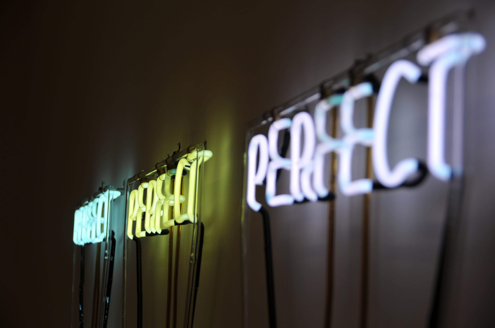
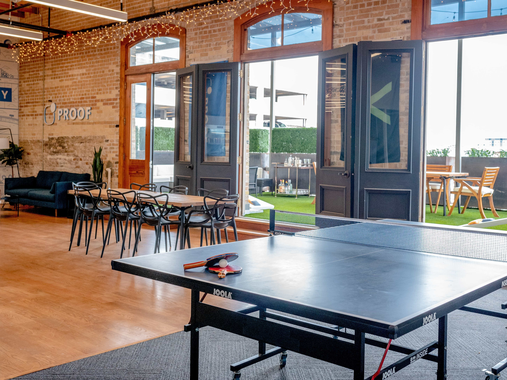
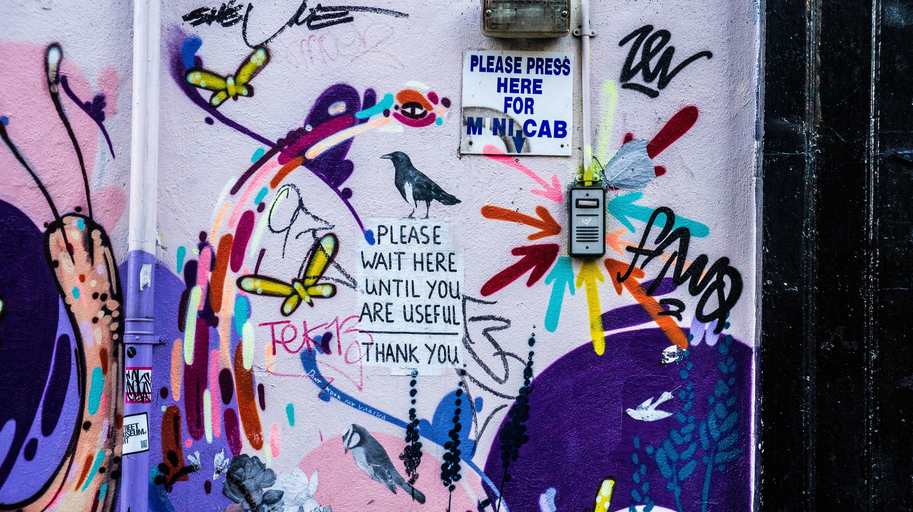

theme: Work, 1
background-color: #FFFFFF
text: #00000, alignment(right)
text-strong: #148BDE
header-strong: #148BDE
header: #00000, line-height(18), text-scale(1.5)
footer-style: #777777, alignment(right), line-height(8), text-scale(0.5), Avenir Next Regular
code: alignment(left), Monako, line-height(1.5)
formula: text-scale(1.5), alignment(center)
list: line-height(16), bullet-character( )
build-lists: true

<!---

The Good, the Bad and the Ugly of Remote Working
40 minutes

-->

# the good, the bad and 
# the ugly of remote working

**Frédéric Harper**
Senior Developer Advocate - DigitalOcean

@fharper

[.footer: https://unsplash.com/photos/e5eDHbmHprg]

^ START CAMTASIA!

---

<!--- Lucky to be remote for 9+ years -->

[.footer: https://unsplash.com/photos/aj79gkfYQ8Q]

---

<!--- Wouldn't change anything -->

[.footer: https://unsplash.com/photos/pKeF6Tt3c08]

---

<!--- It's for everyone -->

[.footer: https://unsplash.com/photos/7XGtYefMXiQ]

---

<!--- May not be for you -->

[.footer: https://unsplash.com/photos/xNJJvB0AkZ8]

---

<!--- THE GOOD -->

# **THE GOOD**

---

<!--- Communte time -->

[.footer: https://unsplash.com/photos/LzxsSWAVMYs]

---

<!--- Productivity -->

[.footer: https://unsplash.com/photos/KE0nC8-58MQ]

---

<!--- ADHD -->

[.footer: https://unsplash.com/photos/QBpZGqEMsKg]

---

<!--- Schedule freedoom -->

[.footer: https://unsplash.com/photos/ft0-Xu4nTvA]

---

<!--- Chores while working -->

[.footer: https://unsplash.com/photos/lgrM1t4rxWQ]

---

<!--- Working everywhere -->

[.footer: https://unsplash.com/photos/S8ffHr_dxHo]

---

<!--- No dress code -->

[.footer: https://unsplash.com/photos/b34E1vh1tYU]

---

<!--- Perfect job for me -->

[.footer: https://unsplash.com/photos/6VWTC9sWu8M]

---

<!--- Working with my cats -->

---

<!--- THE BAD -->

# **THE BAD**

---

<!--- People don't know how to do online meeting -->

[.footer: https://unsplash.com/photos/ASKeuOZqhYU]

---

<!--- Discipline / Many distractions -->

[.footer: https://unsplash.com/photos/6lcT2kRPvnI]

---

<!--- Water cooler discussions -->

[.footer: https://unsplash.com/photos/tJHU4mGSLz4]

---

<!--- You compete against everyone -->

[.footer: https://unsplash.com/photos/fXls-tVemno]

---

<!--- No free lunch / perks -->

[.footer: https://unsplash.com/photos/Ht9FPY8XLog]

---

<!--- Sometimes it's better in-person -->

[.footer: https://unsplash.com/photos/Lks7vei-eAg]

---

<!--- May feel alone -->

[.footer: https://unsplash.com/photos/cqvy_cag4gI]

---

<!--- THE UGLY -->

# **THE UGLY**

---

<!--- Company with no remote culture -->

[.footer: https://unsplash.com/photos/Z9FWNXRcRRk]

---

<!--- Salary based on location -->

[.footer: https://unsplash.com/photos/pElSkGRA2NU]

---

<!--- Easy to become couch potatoe -->

[.footer: https://unsplash.com/photos/ol-mW87J14Q]

---

<!--- Text communications not always easy -->

[.footer: https://unsplash.com/photos/OXkUz1Dp-4g]

---

<!--- Harder to sell yourself -->

[.footer: https://unsplash.com/photos/Dnkr_lmdKi8]

---

<!--- Timezone difference -->

[.footer: https://unsplash.com/photos/QrPDA15pRkM]

---

<!--- No processes -->

[.footer: https://unsplash.com/photos/lCYoIM-fbuU]

---

<!--- Tips & tricks -->

# **TIPS &**
# **TRICKS**

---

<!--- Plan your day -->

[.footer: https://unsplash.com/photos/RLw-UC03Gwc]

---

<!--- Pomodoro technique -->

[.footer: https://unsplash.com/photos/CWAargZlesM]

---

<!--- Meet with your co-workers -->

[.footer: https://unsplash.com/photos/jL8arV2unOA]

---

<!--- Work from coffee shop -->

[.footer: https://unsplash.com/photos/NSFG5sJYZgQ]

---

<!--- You need trust overall -->

[.footer: https://unsplash.com/photos/0ulvCH8PI1E]

---

<!--- Take breaks -->

[.footer: https://unsplash.com/photos/9_n9e0ZeSrQ]

---

<!--- Separate devices or accounts -->

[.footer: https://unsplash.com/photos/I_pOqP6kCOI]

---

<!--- Have a space just for work -->

[.footer: https://unsplash.com/photos/2_BZuGgkP4k]

---

<!--- Invest in good chair and desk -->

[.footer: https://unsplash.com/photos/yJ-wkniutf8]

---

<!--- Silent notifications -->

[.footer: https://unsplash.com/photos/xv7-GlvBLFw]

---

<!--- Over communicate. never assume anything -->

[.footer: https://unsplash.com/photos/-haAxbjiHds]

---

<!--- Celebrate your victory -->

[.footer: https://unsplash.com/photos/GUAcpXPyFRc]

---

<!--- Send victory emails/Slack -->

[.footer: https://unsplash.com/photos/LOHVrTsdvzY]

---

<!--- Conclusion -->

# **SO...**

---

<!--- Do it now -->

[.footer: https://unsplash.com/photos/ukzHlkoz1IE]

---

<!--- Ask your boss -->

[.footer: https://unsplash.com/photos/MYbhN8KaaEc]

---

<!--- Start with one day a week (a month) -->

[.footer: https://unsplash.com/photos/d-pPg9pnZRY]

---

<!--- Find a remote friendly job -->

[.footer: https://unsplash.com/photos/eyfMgGvo9PA]

---

<!--- Read Remote: Office not required from Basecamp founders -->

---

<!--- resources -->

# resources

**slides**
https://github.com/fharper/mytalks

**video**
https://www.youtube.com/user/fredericharper

**remote: office not required**
https://basecamp.com/books/remote

---

<!--- questions & thanks -->

[.footer-style: #777777, alignment(right), text-scale(1.2), Avenir Next Regular]

 

**Frédéric Harper**
 
fharper@do.co
fred.dev

[.footer:  released under unlicense]