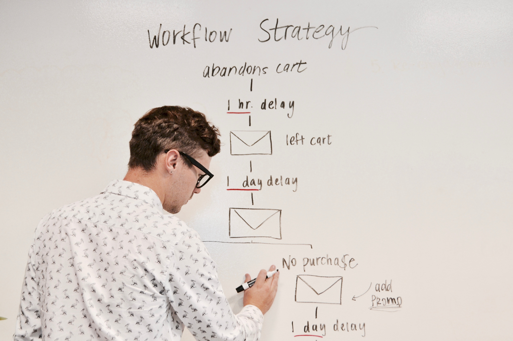
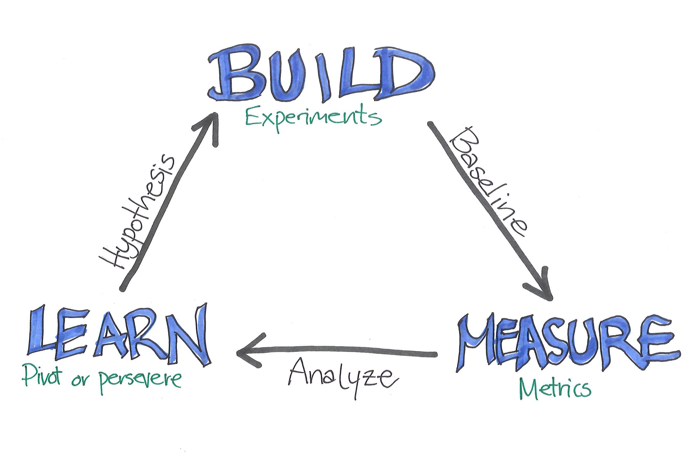
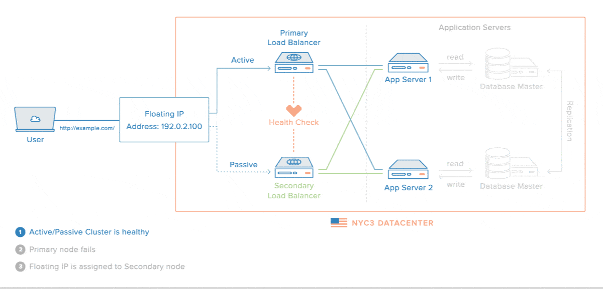
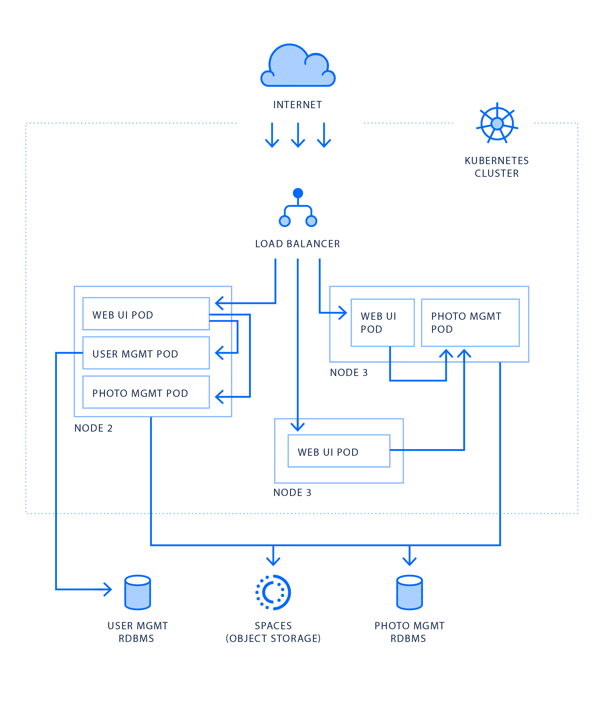

theme: Work, 1
background-color: #FFFFFF
text: #00000, alignment(right)
text-strong: #006AFC
header-strong: #FFFFFF
header: #00000, line-height(18), text-scale(1.5)
footer-style: #777777, alignment(right), text-scale(0.5), Avenir Next Regular
code: alignment(left), Monako, line-height(1.5)
formula: text-scale(1.5), alignment(center)
list: line-height(16), bullet-character( )
build-lists: true

<!---

Scaling in the cloud

Be like Batman

45 minutes

-->

# be
# like
# Batman

 
**Frédéric Harper**
Senior Developer Advocate
DigitalOcean

@fharper

[.footer: https://unsplash.com/photos/zDW2EKOZjZ4]

---

<!--- Devs? -->

[.footer: https://unsplash.com/photos/riEYPSKxoTw]

---

<!--- Non technical people? -->

[.footer: https://unsplash.com/photos/MYbhN8KaaEc]

---

<!--- It's not easy -->

[.footer: https://unsplash.com/photos/mC852jACK1g]

---

<!--- Show you how to be like Batman -->

[.footer: https://unsplash.com/photos/meqVd5zwylI]

---

<!--- Section -->

[.footer: https://unsplash.com/photos/rsXAKLDfqB8]

^
no superpowers

---

<!--- Plan well -->

[.footer: https://unsplash.com/photos/8F4EX4Nw1yY]

---

<!--- You need to be fast -->

[.footer: https://unsplash.com/photos/Lno6-CxVXgo]

---

<!--- Lean startup -->

[.footer: https://hackernoon.com/launch-your-product-training-like-a-lean-startup-644a24143ce0]

---

<!--- Knowledge - your entourage -->

[.footer: https://unsplash.com/photos/PkbZahEG2Ng]

^
Database as a Service

---

<!--- You want to focus on what's important -->

[.footer: https://unsplash.com/photos/0gO3-b-5m80]

---

<!--- You want to focus on what's important -->

[.footer: https://unsplash.com/photos/ieic5Tq8YMk]

---

<!--- Demo: Infrastructure as Code -->

---

<!--- Section -->

[.footer: https://unsplash.com/photos/PhYq704ffdA]

^
Wayne Enterprises

---

<!--- No money -->

[.footer: https://unsplash.com/photos/pElSkGRA2NU]

---

<!--- Hatch -->

---

<!--- Hatch benefits -->

---

<!--- Section -->

[.footer: https://unsplash.com/photos/4pPzKfd6BEg]

^
Batcave

---

<!--- Full architecture -->

---

<!--- Kubernetes -->

---

<!--- Kubernetes infra -->

---

<!--- Section -->

[.footer: https://unsplash.com/photos/n-2_KHgeAy0]

^
Gadgets

---

<!--- Not always perfect scenario : building blocks -->

[.footer: https://unsplash.com/photos/TaEd6ndkRWM]

---

<!--- Automate as much as possible -->

[.footer: https://unsplash.com/photos/R4WCbazrD1g]

---

<!--- resources -->

# resources

**hatch**
do.co/hatch

**Kubernetes**
do.co/introk8s

**Terraform**
terraform.io

**slides & recording**
fred.dev/speaking

---

<!--- questions & thanks -->

[.footer-style: #777777, alignment(right), text-scale(1.2), Avenir Next Regular]

 

**Frédéric Harper**
 
fred@do.co
fred.dev

[.footer:  unlicense]