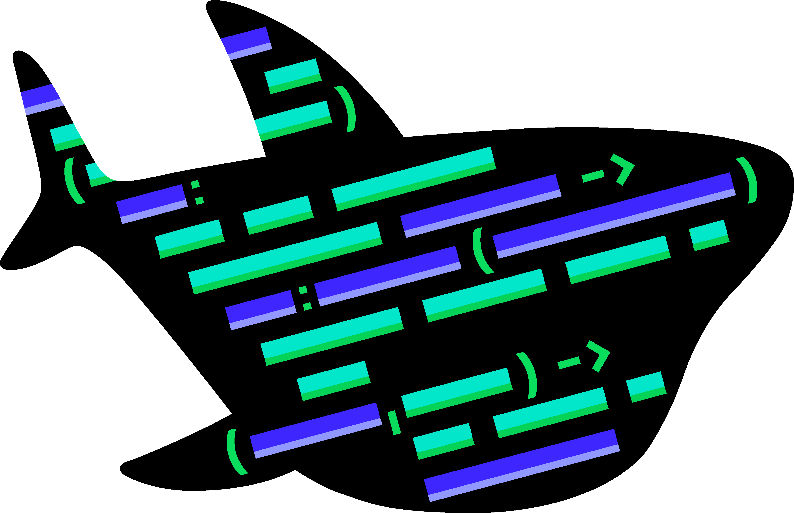

theme: Work, 1
background-color: #FFFFFF
text: #00000, alignment(right)
text-strong: #006AFC
header-strong: #006AFC
header: #00000, line-height(18), text-scale(1.5)
footer-style: #777777, alignment(right), line-height(8), text-scale(0.5), Avenir Next Regular
code: alignment(left), Monako, line-height(1.5)
formula: text-scale(1.5), alignment(center)
list: line-height(16), bullet-character( )
build-lists: true

<!---

Scaling in the cloud with DigitalOcean

45 minutes
25 minutes without spaces & lbass demos + quick demos

-->

# scaling in the cloud
# with DigitalOcean

**Frédéric Harper**
Senior Developer Advocate
DigitalOcean

@fharper

^ START CAMTASIA!

---

<!--- So you want to create a startup -->

[.footer: https://unsplash.com/photos/MYbhN8KaaEc]

---

<!--- It's not easy -->

[.footer: https://unsplash.com/photos/mC852jACK1g]

---

<!--- You want to focus on what's important -->

[.footer: https://unsplash.com/photos/0gO3-b-5m80]

---

<!--- Let me take you to the journey -->

[.footer: https://unsplash.com/photos/dPgPoiUIiXk]

---

<!--- Section -->

# **the idea**

---

<!--- Quick website -->

[.footer: https://unsplash.com/photos/Lno6-CxVXgo]

---

<!--- No money -->

[.footer: https://unsplash.com/photos/pElSkGRA2NU]

---

<!--- Still, no compromise -->

[.footer: https://unsplash.com/photos/S_xVV-l8Q4I]

---

<!--- Demo: droplet -->

^
Free DNS management
Droplet
Or marketplace
https://cloud.digitalocean.com/droplets/new

---

<!--- Section -->

# **it's a start**

---

<!--- Stuck with your CEO -->

[.footer: https://unsplash.com/photos/ENyfrgkZb7M]

---

<!--- Making a video -->

[.footer: https://unsplash.com/photos/CiUR8zISX60]

---

<!--- So you want something fast -->

[.footer: https://unsplash.com/photos/1Mq4QQaVhis]

---

<!--- Demo: spaces -->

---

<!--- Section -->

# **mvp**

---

<!--- Working on the MVP -->

[.footer: https://unsplash.com/photos/tZc3vjPCk-Q]

---

<!--- You want to focus on what's important -->

[.footer: https://unsplash.com/photos/ieic5Tq8YMk]

---

<!--- Managing databases? -->

[.footer: https://unsplash.com/photos/PkbZahEG2Ng]

---

<!--- Demo: DBaaS -->

^
show tables

---

<!--- Section -->

# **it's serious now**

---

<!--- Meeting with VC -->

[.footer: https://unsplash.com/photos/eYZpTMc7hno]

---

<!--- You start acquiring new users -->

[.footer: https://unsplash.com/photos/wEFvY8mi1zc]

---

<!--- You need to scale -->

[.footer: https://unsplash.com/photos/rk_Zz3b7G2Y]

---

<!--- Demo: load balancer -->

---

<!--- Section -->

# **money**

---

<!--- On your way to be the next unicorn -->

[.footer: https://unsplash.com/photos/opkaRk20tAw]

---

<!--- Shit got real -->

[.footer: https://unsplash.com/photos/t8T_yUgCKSM]

---

<!--- Don't go crazy -->

[.footer: https://unsplash.com/photos/zEFyM4sulJ8]

---

<!--- Demo: Kubernetes -->

---

<!--- Section -->

# **congrats**

---

<!--- Not always perfect scenario : building blocks -->

[.footer: https://unsplash.com/photos/TaEd6ndkRWM]

---

<!--- Let's be honest: you can do this on all cloud -->

[.footer: https://unsplash.com/photos/80sv993lUKI]

---

<!--- What is making us great, it's easy -->

[.footer: https://unsplash.com/photos/mWvG5wGJq6U]

---

<!--- You can do all this at the command line -->

[.footer: https://unsplash.com/photos/46T6nVjRc2w]

---

<!--- You also have monitoring -->

[.footer: https://unsplash.com/photos/HUJDz6CJEaM]

---

<!--- Inexpensive & predictable -->

[.footer: https://unsplash.com/photos/1UD3QX92V6o]

---

<!--- Hatch -->

---

<!--- Hatch benefits -->

---

<!--- OSS Currents Survey -->

### do.co/currentsOSS

---

<!--- resources -->

# resources

**hatch**
do.co/hatch

**slides**
github.com/fharper/mytalks

**video**
do.co/youtube

---

<!--- questions & thanks -->

[.footer-style: #777777, alignment(right), text-scale(1.2), Avenir Next Regular]

 

**Frédéric Harper**
 
fred@do.co
fred.dev

[.footer:  unlicense]